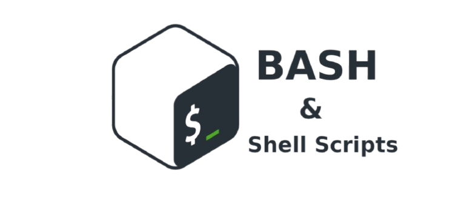
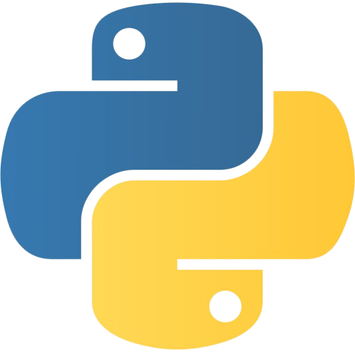

# ByteBase

## Dependencies and prerequisites

1. GCC (GNU Compiler Collection) version 15.2
2. GNU Make 4.3
3. Python 3.10.12
4. pip 22.0.2 
5. faker 40.8.0 (Python library)

"faker" installation:

``` bash
pip install faker
```

## What is ByteBase?

Bytebase is a DataBase system that simulates a functional database made from a binary file called "db.bin" — a persistent data file in MATLAB v4 (.mat) format, containing matrix-structured records.

The ideia is to simulate a database system based on functions like WHERE, INSERT, SELECT, UPDATE, DELETE from SQL and some own features like GET. The system is made to insert and manage users with the following data: Name, Age, RG (Brazilian General Registry) and CPF (Brazilian Individual Taxpayer Registration).

The insertion and managment of the users from the database is made all from the terminal by CLI commands with subcommands, flags and arguments that call functions by APIs that act over the database file. 

The goal of this portfolio project is to understand how a simple, but functional, database based on big systems works, the concepts go from learning in practice how binary files handling work in C to understanding how database systems handle record insertions, queries, deletions and updates.

## Download

1. git clone:

SSH 

 ```bash
git clone git@github.com:igorruiz123-py/wordx.git
```

HTTPS

 ```bash
git clone https://github.com/igorruiz123-py/ByteBase.git
```

2. Zip folder:

On the wordx project home page on github go to:

```Code -> Download ZIP``` 

Note: extract the zip in order to save the packege in a place of your preference.

## Makefile Commands

*Make sure to be on the same directory of "Makefile" file to run the "make" commands.* 

1. Setting environment up

``` bash
make build
```

2. Compilation of C source code files

``` bash
make compile
```

3. Injection of fake users into the database

``` bash
make inject
```

4. Removal of compiled code files

``` bash
make rmcode
```

5. Removal of database file

``` bash
make rmdb
```
*For more information about the "make" commands, go to docs/bytebase_manual.txt*

## ByteBase Commands

* Make sure to be on the same directory of "bytebase" file to run the "bytebase" commands. * 

1. INSERT

```bash
./bytebase INSERT -name <user_name> -age <user_age> -rg <user_rg> -cpf <user_cpf>
```

2. SELECT WHERE

```bash
./bytebase SELECT -option <options> WHERE -id <index>
```

3. DELETE WHERE

```bash
./bytebase DELETE WHERE -id <index>
```

4. UPDATE WHERE

```bash
./bytebase UPDATE -option <option> WHERE -id <index> -newcontent <newcontent>
```

5. GET

```bash
./bytebase GET -actives
```

*For more information about the "bytebase" commands, go to docs/make_manual.txt*

## Technologies

<p>
         
</p>


# Made with ❤️ by Igor Ruiz, Cybersecurity Student from Federal University of Itajuba.